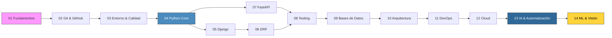

# Guía de Desarrollo Python

> De cero a senior: backend web, automatización, machine learning, IA y sistemas complejos.
> Todo en español, con código en Python.


---

> [!IMPORTANT]
> **Lo que vas a lograr con esta guía:**
> Desarrollar la capacidad de construir sistemas reales en Python — desde APIs hasta pipelines de ML — entendiendo el “por qué” detrás de cada decisión técnica, no solo el “cómo”.

<details>
<summary>Tabla de contenidos</summary>

- [Cómo usar esta guía](#cómo-usar-esta-guía)
- [Mapa de aprendizaje](#mapa-de-aprendizaje)
- [Las 14 áreas](#las-14-áreas)
- [Rutas de aprendizaje](#rutas-de-aprendizaje)
- [Ideas de proyecto](#ideas-de-proyecto)
- [Repositorios de referencia](#repositorios-de-referencia)

</details>

---

## Cómo usar esta guía

Esta guía está diseñada para leerse **en orden y sin saltarse archivos**. Cada archivo:

1. Se puede completar en una sesión de estudio (20–40 min de lectura activa)
2. Incluye ejemplos ejecutables — cópialos, modifícalos, rómpelos
3. Tiene una sección de referencias al final organizada en 3 momentos de lectura
4. Termina con errores comunes reales, no teóricos

> [!TIP]
> **Antes de empezar:** Abre una terminal con Python 3.11+ instalado. Cada área tiene un `README.md` propio que explica qué necesitas tener listo antes de comenzar esa sección.

> [!NOTE]
> **Sobre el idioma:** Las explicaciones están en español. El código, los nombres de variables, funciones, clases y términos técnicos de la industria están en inglés. Así es como se trabaja en equipos reales.

---

## Mapa de aprendizaje



---

## Las 14 áreas

### Fundamentos y entorno

| # | Área | Qué aprenderás |
|---|------|----------------|
| 01 | [Fundamentos](./01-fundamentos/) | Linux, terminal, redes, HTTP, principios de ingeniería de software |
| 02 | [Version Control](./02-version-control/) | Git desde cero hasta avanzado, flujos de trabajo en GitHub |
| 03 | [Entorno & Calidad](./03-entorno-y-calidad/) | IDE, pyenv, virtualenv, linting, pre-commit, Makefile |

### Python

| # | Área | Qué aprenderás |
|---|------|----------------|
| 04 | [Python](./04-python/) | Tipos, OOP, patrones avanzados, automatización, scraping, datos, consumo de APIs |

### Frameworks web

| # | Área | Qué aprenderás |
|---|------|----------------|
| 05 | [Django](./05-django/) | ORM, migraciones, Admin, signals, comandos de gestión |
| 06 | [Django REST Framework](./06-django-rest-framework/) | Serializers, ViewSets, autenticación JWT, OpenAPI |
| 07 | [FastAPI](./07-fastapi/) | ASGI, Pydantic nativo, async, SQLAlchemy async, comparativa con Django |

### Calidad y datos

| # | Área | Qué aprenderás |
|---|------|----------------|
| 08 | [Testing](./08-testing/) | pytest, fixtures, mocking, TDD, coverage, Postman |
| 09 | [Bases de datos](./09-base-de-datos/) | Diseño ERD, PostgreSQL, SQLAlchemy, Alembic |

### Sistemas y plataforma

| # | Área | Qué aprenderás |
|---|------|----------------|
| 10 | [Arquitectura](./10-arquitectura/) | Patrones de diseño, system design, DDD, CQRS, mensajería |
| 11 | [DevOps e Infraestructura](./11-devops-e-infraestructura/) | Docker, GitHub Actions, NGINX, deploy, observabilidad |
| 12 | [Cloud](./12-cloud/) | AWS, GCP y Azure: compute, storage, serverless, IAM |

### IA y datos

| # | Área | Qué aprenderás |
|---|------|----------------|
| 13 | [IA & Automatización](./13-ia-y-automatizacion/) | Prompting, Claude API, agentes, MCP, Claude Code, GitHub Copilot |
| 14 | [ML & Visión](./14-machine-learning-y-vision/) | numpy, pandas, sklearn, OpenCV, YOLO, PyTorch, Hugging Face |

---

## Rutas de aprendizaje

Dependiendo de tu objetivo, puedes priorizar una ruta. Todas asumen que has completado las áreas 01–04.

<details>
<summary>Ruta A — Desarrollador Backend Web</summary>

```
01 → 02 → 03 → 04 → 05 → 06 → 08 → 09 → 10 → 11 → 12
```

Enfoque: Django + DRF, testing sólido, bases de datos, deploy en cloud.
Tiempo estimado: 6–8 meses de estudio activo.

</details>

<details>
<summary>Ruta B — Desarrollador FastAPI / APIs Modernas</summary>

```
01 → 02 → 03 → 04 → 07 → 08 → 09 → 10 → 11 → 12
```

Enfoque: FastAPI async, SQLAlchemy, Alembic, arquitectura hexagonal.
Tiempo estimado: 4–6 meses de estudio activo.

</details>

<details>
<summary>Ruta C — Desarrollador IA / LLM</summary>

```
01 → 02 → 03 → 04 → 07 → 08 → 09 → 13 → 14
```

Enfoque: FastAPI para servir modelos, integración de LLMs, prompting, agentes, RAG.
Tiempo estimado: 5–7 meses de estudio activo.

</details>

<details>
<summary>Ruta D — Automatización y Scripts</summary>

```
01 → 02 → 03 → 04 (incluye procesamiento-y-automatizacion) → 08 → 11
```

Enfoque: scripting, scraping, procesamiento de datos, CI/CD, GitHub Actions.
Tiempo estimado: 3–4 meses de estudio activo.

</details>

<details>
<summary>Ruta E — Ruta completa (Junior → Senior)</summary>

```
01 → 02 → 03 → 04 → 05 → 06 → 07 → 08 → 09 → 10 → 11 → 12 → 13 → 14
```

La guía en orden completo. Cada área prepara la siguiente.

</details>

---

## Ideas de proyecto

Proyectos concretos que combinan múltiples áreas de esta guía con APIs públicas reales. Cada uno tiene potencial comercial y sirve como portfolio.

> [!NOTE]
> Los ejemplos de código dentro de la guía usan estas mismas APIs. Aprenderás consumíndolas en contexto, no en ejemplos desconectados.

| Proyecto | Stack principal | APIs sugeridas | Áreas | Potencial |
|----------|----------------|----------------|-------|-----------|
| **Dashboard climático** | Django + DRF + Celery + PostgreSQL | [OpenWeatherMap](https://openweathermap.org/api), [NASA EONET](https://eonet.gsfc.nasa.gov/) | 05, 06, 09, 11 | SaaS B2B para agricultores, logística |
| **Resumen de noticias con IA** | FastAPI + Claude API + Redis | [NewsAPI](https://newsapi.org/), [Reddit API](https://www.reddit.com/dev/api/) | 07, 13 | Producto de contenido / newsletter |
| **Detección de objetos como servicio** | FastAPI + PyTorch + Docker + S3 | Imágenes propias o [Pexels API](https://www.pexels.com/api/) | 07, 11, 12, 14 | SaaS de visión para e-commerce, seguridad |
| **Asistente de entrevistas técnicas** | Django + DRF + Claude API + pgvector | [GitHub API](https://docs.github.com/en/rest) | 05, 06, 09, 13 | EdTech / preparación para FAANG |
| **Monitor de criptomonedas + alertas** | FastAPI + Celery + WebSockets | [CoinGecko API](https://www.coingecko.com/api/documentation) | 07, 09, 10, 11 | FinTech / bots de trading educativos |
| **Generador de documentación técnica** | FastAPI + Claude API + GitHub API | [GitHub REST API](https://docs.github.com/en/rest) | 07, 13 | DevTools / integración en CI/CD |
| **Sistema de análisis de sentimientos** | Django + sklearn + Claude API | [Twitter/X API](https://developer.twitter.com/), [YouTube Data API](https://developers.google.com/youtube/v3) | 05, 13, 14 | SaaS de brand monitoring |
| **Pipeline de datos astronómicos** | FastAPI + pandas + PostgreSQL | [NASA APIs](https://api.nasa.gov/), [SpaceX API](https://github.com/r-spacex/SpaceX-API) | 04, 07, 09 | Portfolio de data engineering |

> [!TIP]
> **¿Por dónde empezar un proyecto?** Elige uno que combine como mínimo 3 áreas que ya hayas completado. El proyecto te mostrará los gaps reales en tu conocimiento.

---

## Repositorios de referencia

Recursos curados que se referencian a lo largo de la guía. No son lecturas previas — aparecen en el momento exacto en que son relevantes.

| Repositorio | Qué aporta | Secciones donde aparece |
|-------------|------------|-----------------------|
| [donnemartin/system-design-primer](https://github.com/donnemartin/system-design-primer) | Diagramas y trade-offs de arquitectura a escala | `10-arquitectura` |
| [vinta/awesome-python](https://github.com/vinta/awesome-python) | Directorio curado del ecosistema Python | `04-python`, `08-testing`, `09-base-de-datos` |
| [cheatsnake/backend-cheats](https://github.com/cheatsnake/backend-cheats) | Diagramas visuales de redes, APIs, DevOps | `01-fundamentos`, `09-base-de-datos`, `11-devops` |
| [LeCoupa/awesome-cheatsheets](https://github.com/LeCoupa/awesome-cheatsheets) | Cheatsheets de Python, Django, Docker | `04-python`, `05-django`, `11-devops` |
| [codecrafters-io/build-your-own-x](https://github.com/codecrafters-io/build-your-own-x) | Construye Redis, HTTP server, Docker desde cero | `09-base-de-datos`, `10-arquitectura` |
| [ripienaar/free-for-dev](https://github.com/ripienaar/free-for-dev) | Servicios gratuitos para aprender DevOps y cloud | `11-devops`, `12-cloud` |
| [roboflow/notebooks](https://github.com/roboflow/notebooks) | Tutoriales YOLO, segmentación, clasificación | `14-machine-learning-y-vision` |
| [Siddhant-Goswami/100x-LLM](https://github.com/Siddhant-Goswami/100x-LLM) | Prompting, RAG, FastAPI + LLMs | `13-ia-y-automatizacion` |
| [public-apis/public-apis](https://github.com/public-apis/public-apis) | APIs públicas para ejemplos y proyectos | Toda la guía |

---

**Navegación**  
[Comenzar: 01 — Fundamentos →](./01-fundamentos/README.md)
